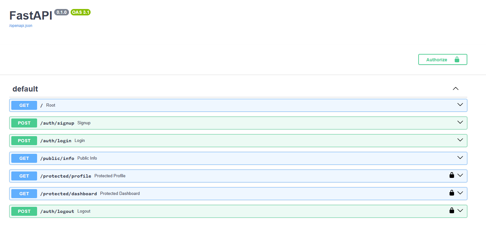

# FlyRank Week 4 — Auth, Login & Protect

A secure FastAPI backend that uses **Supabase Auth** as an Identity Provider to handle
user signup, login, logout, and to protect specific routes using JWT bearer tokens.

## What this project does

- Registers and authenticates users through Supabase (no passwords are stored or hashed locally)
- Issues and verifies JWT access tokens
- Protects specific endpoints so they only respond to logged-in users
- Reuses a single dependency (`get_current_user`) to guard multiple routes
- Documents the whole flow in Swagger UI with bearer-token authorization

## Setup

1. Clone this repo and create a virtual environment:

   python -m venv venv
   venv\Scripts\activate

2. Install dependencies:

   pip install fastapi uvicorn supabase python-dotenv

3. Create a `.env` file in the project root (see `.env.example` for the required keys):

   SUPABASE_URL=your_project_url
   SUPABASE_KEY=your_anon_key
   PORT=8000

4. In your Supabase project dashboard, go to Authentication > Providers > Email and disable
   "Confirm email", so a fresh signup can log in immediately without email verification.

## Run

   uvicorn main:app --reload --port 8000

The server runs at http://localhost:8000. Interactive Swagger docs are available at
http://localhost:8000/docs.

## API Reference

| Method | Endpoint              | Auth required | Description                          |
|--------|-----------------------|---------------|---------------------------------------|
| POST   | /auth/signup          | No            | Create a new user account            |
| POST   | /auth/login           | No            | Authenticate and receive a JWT       |
| POST   | /auth/logout          | Yes (Bearer)  | End the user's session               |
| GET    | /public/info          | No            | Public, unprotected data             |
| GET    | /protected/profile    | Yes (Bearer)  | Read the logged-in user's profile    |
| GET    | /protected/dashboard  | Yes (Bearer)  | Example second protected route, reuses the same guard |

## Swagger UI

Protected routes show a lock icon, and the "Authorize" button lets you paste a token once
and reuse it across all protected endpoints:

## Status codes used

- 201 — signup success
- 200 — login / read success
- 204 — logout success
- 400 — missing or invalid input
- 401 — missing, malformed, or invalid/expired token